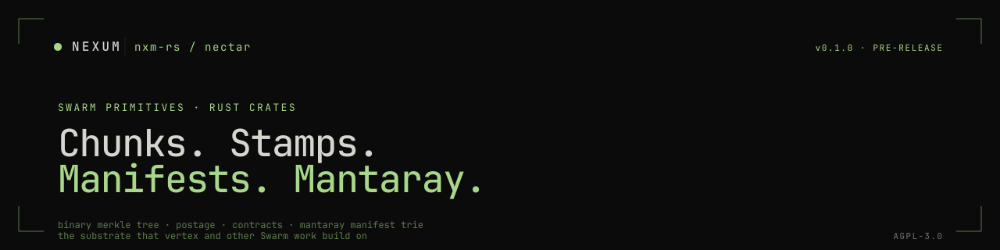

<p align="center">
  
</p>

**Low-level Ethereum Swarm primitives in Rust** — the tedious bits that make the magic happen. Content addressing, chunk management, postage stamps, manifest tries, contract bindings.

Used by [`nxm-rs/vertex`](https://github.com/nxm-rs/vertex) (the Rust Swarm node) and available for anyone building Swarm-powered Rust applications who'd rather import a vetted primitives crate than re-implement the wire format.

> Looking for the org overview? See **[github.com/nxm-rs](https://github.com/nxm-rs)**.

---

## Status

| | |
|---|---|
| Version | **0.1.0** · pre-release |
| MSRV | Rust 1.87 · edition 2024 |
| License | [AGPL-3.0-or-later](./LICENSE) |

> Pre-release; APIs may shift. Not yet on crates.io.

---

## Crates

| Crate | What it is |
|---|---|
| **[`nectar-primitives`](./crates/primitives)** | Binary Merkle Tree, chunks, proofs · the foundation |
| **[`nectar-mantaray`](./crates/mantaray)** | Mantaray manifest trie · path-to-reference mapping |
| **[`nectar-postage`](./crates/postage)** | Postage stamp handling + verification |
| **[`nectar-postage-issuer`](./crates/postage-issuer)** | High-performance stamp issuance with parallel signing |
| **[`nectar-contracts`](./crates/contracts)** | Contract bindings for on-chain Swarm interactions |
| **[`nectar-swarms`](./crates/swarms)** | Network identifiers (mainnet, testnet, etc.) |
| **[`wasm-demo`](./crates/wasm-demo)** | In-browser demo of the primitives compiled to WASM |

---

## Quick start

```toml
[dependencies]
nectar-primitives = { git = "https://github.com/nxm-rs/nectar", rev = "..." }
```

```rust
use nectar_primitives::{DefaultHasher, DefaultContentChunk};

// Hash some data with the Binary Merkle Tree
let mut hasher = DefaultHasher::new();
hasher.set_span(data.len() as u64);
hasher.update(&data);
let root_hash = hasher.sum();
```

Until crates.io publishing lands, depend by git rev. The intent is to track each crate version independently once the public API is stable.

---

## Sibling repos

| Repo | Role |
|---|---|
| **[vertex](https://github.com/nxm-rs/vertex)** | Rust Swarm node — primary consumer of these primitives |
| **[nectar](https://github.com/nxm-rs/nectar)** | Low-level primitives (this repo) |

The Swarm subsystem under Nexum exists because the [wallet](https://github.com/nxm-rs/wallet) needs content-addressed storage for firewall rulesets, ABI snapshots, and shared state.

---

## Repository layout

```
nectar/
├── crates/
│   ├── primitives/        ← BMT, chunks, proofs
│   ├── mantaray/          ← manifest trie
│   ├── postage/           ← stamp handling
│   ├── postage-issuer/    ← parallel stamp issuance
│   ├── contracts/         ← on-chain bindings
│   ├── swarms/            ← network IDs
│   └── wasm-demo/         ← in-browser primitives demo
├── flake.nix              ← nix dev shell
└── Cargo.toml             ← workspace
```

---

## Contributing

Pre-release; APIs still in flux. Open an issue before non-trivial PRs.

- **Rust** — `cargo fmt`, `cargo clippy -- -D warnings`. MSRV 1.87, edition 2024.
- **Commits** — Conventional Commits.
- **Tests for protocol-touching changes are non-optional.** Wire-format regressions are expensive to debug after the fact.
- **No new dependencies** without a justification in the PR description.

A CLA is in [`CLA.md`](./CLA.md) and tracked in [`nxm-rs/cla-signatures`](https://github.com/nxm-rs/cla-signatures).

## Security

See [SECURITY.md](https://github.com/nxm-rs/.github/blob/main/SECURITY.md) on the org `.github` repo. Findings in chunk hashing, postage-stamp verification, or manifest resolution are particularly high-value — please use GitHub Security Advisories on this repo for those.

## License

AGPL-3.0-or-later. See [LICENSE](./LICENSE).

```
●  AGPL-3.0  ·  pre-release  ·  substrate under vertex
```
